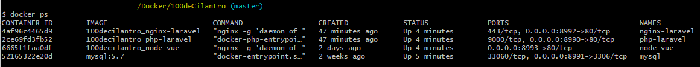

# 100deCilantroDocker

## Integrantes
- Sebastian Ayala Suarez
- Jhorman Duvan Vacca Manzano
- Jose Luis Nova Arguello

## Despliegue
Para poder desplegar este proyecto se debe instalar todo lo listado a continuación.

- Docker
- Git

## Copia de los archivos del proyecto

Para tener los archivos del proyecto se debe clonar el repositorio ubicado en el siguiente link: https://github.com/SebasAyala/100deCilantroDocker. Este proceso se puede realizar con el comando:

```
git clone https://github.com/SebasAyala/100deCilantroDocker.git
```

## Subida de los contenedores
Para subir los contenedores se debe ejecutar docker. Posterior a esto, se debe ubicar la consola en la carpeta del proyecto y ejecutar el siguiente comando.

```
docker-compose up -d --build mysql && docker-compose up -d --build php-laravel && docker-compose up -d --build nginx-laravel && docker-compose up -d --build node-vue
```
En caso que se desee comprobar el correcto funcionamiento de los contendores, se puede ejecutar el siguiente comando.

```
docker ps
```

El comando debe arrojar un resultado como este.



## Ejecutar migraciones de la BD
Para ejecutar las migraciones de la base de datos, se debe acceder a la consola del contenedor de Laravel. Para esto, se debe ejecutar el siguiente comando.

```
docker exec -it php-laravel bash
```
Y seguidamente
```
php artisan migrate --seed
```

## Ejecutar migraciones de la BD
Para ejecutar las migraciones de la base de datos, se debe acceder a la consola del contenedor de Laravel. Para esto, se debe ejecutar el siguiente comando.
```
docker exec -it php-laravel bash
```
Y seguidamente
```
php artisan migrate --seed
```
